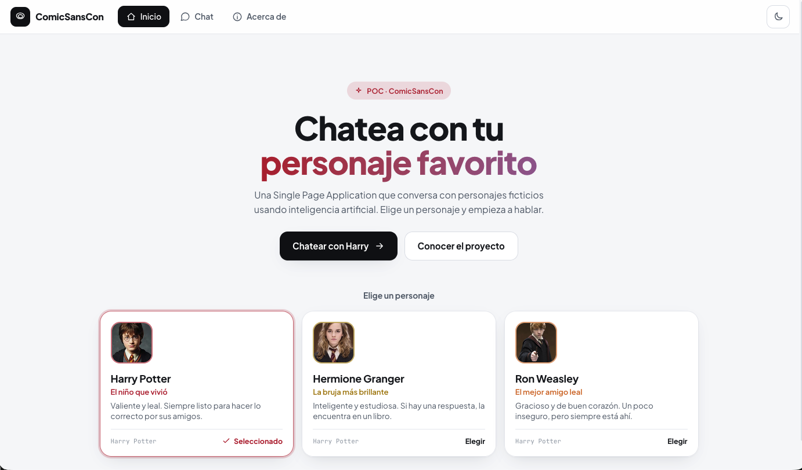
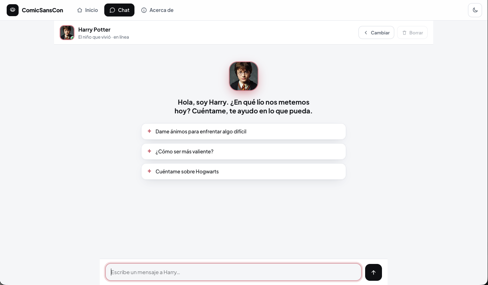

# 🌀 Portal Chat — Chatea con tu personaje favorito

Single Page Application (SPA) que permite conversar con personajes ficticios usando
**Google Gemini AI**. Proyecto Integrador 3 — agencia ficticia **ComicSansCon**.

Construida con **HTML, CSS y JavaScript puro (sin frameworks)**. La clave de API de
Gemini nunca se expone en el cliente: vive en una **Vercel Serverless Function** que
actúa como proxy seguro.

> 🔗 **Demo desplegada:** https://chat-with-ai-character-gemini.vercel.app/chat




---

## ✨ Características

- **3 vistas con routing SPA** (History API): `/home`, `/chat`, `/about`. Funcionan los
  botones **atrás/adelante** del navegador (evento `popstate`).
- **Galería de 3 personajes**, cada uno con su **system prompt único**:
  - 🔴 **Harry Potter** — valiente y leal, el niño que vivió.
  - 🟡 **Hermione Granger** — la bruja más brillante de su generación.
  - 🟠 **Ron Weasley** — el mejor amigo, gracioso y de buen corazón.
- **Diseño mobile-first** responsive con 3 breakpoints (móvil, tablet ≥640px, escritorio ≥1024px).
- **Chat completo**: diferenciación visual usuario/personaje, estado "escribiendo…" animado,
  manejo de errores, scroll automático, **Enter para enviar** y **botón de copiar** respuestas.
- **Historial** mantenido en la sesión y **persistido en `localStorage`** (con indicador visual
  de historial guardado y botón de **borrar historial**).
- **Modo claro/oscuro** con toggle.
- **Timestamps** en cada mensaje.
- **Integración segura con Gemini** mediante Serverless Function (la API key nunca llega al frontend).
- **Tests unitarios con Vitest** (mock de `fetch`, sin red).

> **Modo demo:** si abres el sitio sin backend (por ejemplo, como estático sin `vercel dev`),
> el chat detecta que no hay función serverless y responde con frases simuladas "en personaje",
> mostrando un aviso. Con `vercel dev` + tu API key se usa **Gemini real**.

---

## 📁 Estructura del proyecto

```
portal-chat/
├── api/
│   └── chat.js          # Serverless Function: proxy seguro a Gemini
├── src/
│   ├── styles.css       # Estilos mobile-first (claro/oscuro)
│   ├── app.js           # Lógica principal + routing + render
│   ├── chat.js          # Comunicación con el backend + modo demo
│   ├── router.js        # Routing puro (testeable)
│   ├── utils.js         # Funciones puras: transform/parse/storage/time
│   ├── hpapi.js         # Capa de datos de la HP API (fetch + parseo)
│   └── characters.js    # Datos de personajes + system prompts
├── tests/
│   ├── utils.test.js    # Tests de transformación y persistencia
│   ├── chat.test.js     # Tests de fetch (mockeado) y modo demo
│   ├── hpapi.test.js    # Tests de la HP API (parseo/búsqueda + fetch mock)
│   └── app.test.js      # Tests de routing y personajes
├── index.html
├── vercel.json          # Rewrites para que el routing SPA funcione
├── package.json
├── .env.example        # Plantilla pública (sin valores reales)
├── .env.local          # Tu clave REAL — ignorado por git, nunca se sube
├── .gitignore
└── README.md
```

---

## 🚀 Ejecutar en local

### Requisitos
- [Node.js](https://nodejs.org/) 18 o superior.
- [Vercel CLI](https://vercel.com/docs/cli): `npm i -g vercel`
- Una API key de Google Gemini → [Google AI Studio](https://aistudio.google.com/app/apikey).

### Pasos

```bash
# 1. Instalar dependencias (solo para los tests)
npm install

# 2. Crear tu archivo de variables locales a partir de la plantilla
cp .env.example .env.local
# edita .env.local y pega tu clave real en GEMINI_API_KEY

# 3. Levantar el proyecto con las serverless functions
vercel dev
```

Abre la URL que indica la consola (normalmente `http://localhost:3000`).

> Sin `vercel dev` puedes servir `index.html` con cualquier servidor estático, pero el chat
> funcionará en **modo demo** (sin IA real), ya que `/api/chat` no estará disponible.

### 🔐 Seguridad de la API key

- Tu clave **real** vive solo en **`.env.local`** (en tu máquina). La Vercel CLI lo carga
  automáticamente con `vercel dev`. También puedes usar `.env`; ambos están en `.gitignore`.
- **`.env.local` y `.env` NUNCA se suben a GitHub.** Antes de tu primer commit, verifica con
  `git status` que no aparecen en la lista.
- Lo único que se versiona es **`.env.example`**, que contiene los *nombres* de las variables
  sin valores reales.
- La clave **nunca llega al navegador**: solo la lee `api/chat.js` en el servidor vía
  `process.env.GEMINI_API_KEY`.
- En **producción** no se usa ningún archivo: la clave se configura en
  **Vercel → Settings → Environment Variables**.
- Si expusiste la clave por error (commit, captura, etc.), **revócala y genera una nueva** en
  [Google AI Studio](https://aistudio.google.com/app/apikey). Una clave filtrada se considera
  comprometida aunque la borres después.

---

## 🧪 Tests

```bash
npm test            # ejecuta todos los tests una vez
npm run test:watch  # modo watch
```

Los tests cubren:
- Transformación del historial al formato de Gemini (`toGeminiContents`).
- Parseo seguro de la respuesta de Gemini (`parseGeminiResponse`).
- Formateo de fechas, escape de HTML y persistencia en `localStorage`.
- `requestReply` con `fetch` **mockeado** (casos OK y error).
- Routing (`parseRoute`, `pathForRoute`) y selección de personajes.

---

## ☁️ Desplegar en Vercel

1. Sube el repositorio a GitHub (asegúrate de que `.env` **no** esté incluido).
2. En [vercel.com](https://vercel.com), importa el repositorio.
3. En **Settings → Environment Variables**, añade:
   - `GEMINI_API_KEY` = tu clave de Gemini.
   - (Opcional) `GEMINI_MODEL` = `gemini-2.0-flash`.
4. Despliega. Vercel detecta automáticamente la función en `api/chat.js`.
5. Verifica que el chat responde (eso confirma que la serverless function funciona).

---

## 🔌 ¿Cómo se mantiene el contexto?

Gemini no recuerda conversaciones por sí solo. En **cada** petición, el frontend envía
**todo el historial** de mensajes a `/api/chat`, que lo reenvía a Gemini junto con el
`systemInstruction` del personaje. Así el personaje responde teniendo en cuenta lo ya hablado.

---

## 🤖 Registro del uso de IA

📄 [Registro completo de uso de IA (PDF)](./docs/Registro%20de%20uso%20de%20IA%20%E2%80%94%20Portal%20Chat.pdf)

Durante el desarrollo se usó IA como apoyo. Ejemplos de prompts y decisiones:

- **System prompts de los personajes:** se iteraron en Google AI Studio para lograr respuestas
  cortas, en español y fieles a cada personalidad. Decisión: limitar a 1–3 frases y prohibir
  romper el personaje o admitir ser una IA.
- **Estructura del proxy seguro:** se confirmó el formato de `contents` / `systemInstruction`
  de la API `generateContent` de Gemini y el manejo de errores HTTP.
- **Tests:** se diseñaron casos de borde (JSON corrupto, respuesta sin texto, fetch fallido)
  a partir de sugerencias de IA, revisando y ajustando cada aserción manualmente.

_(Personaliza esta sección con tus prompts reales.)_

---

## 📝 Licencia / créditos

Proyecto educativo. Las imágenes y datos de los personajes provienen de la
[HP API](https://hp-api.onrender.com/). Los personajes son propiedad de sus
respectivos dueños; este proyecto es una práctica sin fines comerciales.
